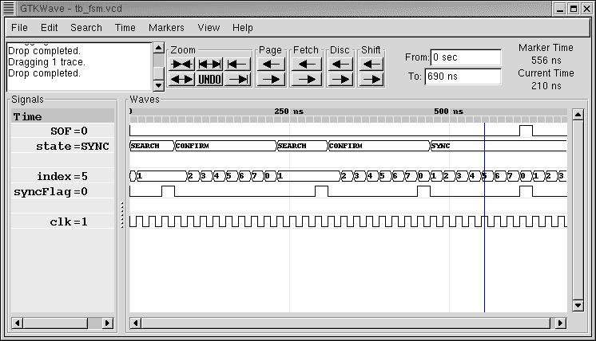

.. currentmodule:: myhdl

.. _model-rtl:

****************
Modelamiento RTL
****************

Introducción
============

.. index:: single: modeling; RTL style

..
 RTL (Register Transfer Level) is a modeling abstraction level that
 is typically used to write synthesizable models.
 :dfn:`Synthesis` refers to the process by which an HDL description
 is automatically compiled into an implementation for an ASIC or FPGA.
 This chapter describes how MyHDL supports it.

RTL (*Register Transfer Level*) es una abstracción de modelamiento que se
usa típicamente para escribir modelos sintetizables.
:dfn:`Sinthesis` se refiere al proceso por el cual una descripción de
hardware es compilada automáticamente en una implementación por un ASIC o
un FPGA. Este capítulo describe cómo MyHDL permite usar esta técnica.

.. _model-comb:

Lógica combinacional
====================

.. index:: single: combinatorial logic

.. _model-comb-templ:

Plantilla
---------

.. Combinatorial logic is described with a code pattern as follows::

La lógica combinaciona está descrita con un patrón de código así::
  
 def top(<parameters>):
       ...
       @always_comb
       def combLogic():
           <functional code>
       ...
       return combLogic, ...

..
 The :func:`always_comb` decorator describes combinatorial logic.  [#]_. The
 decorated function is a local function that specifies what happens when one of
 the input signals of the logic changes.  The :func:`always_comb` decorator
 infers the input signals automatically. It returns a generator that is sensitive
 to all inputs, and that executes the function whenever an input changes.

El decorador :func:`always_comb` describe la lógica combinacional. [#]_. La
función decorada es una función local que especifica qué pasa cuando una de
las señales de entrada de la lógica cambia. El decorador
:func:`always_comb` infiere las señales de entrada automáticamente. Retorna
un generador que es sensible a todas las entradas, y que ejecuta la función
cuando una entrada cambia.

.. _model-comb-ex:

Ejemplo
--------

.. The following is an example of a combinatorial multiplexer::

El siguiente es un ejemplo de un multiplexor combinacional::

   from myhdl import Signal, Simulation, delay, always_comb

   def Mux(z, a, b, sel):

       """ Multiplexer.

       z -- mux output
       a, b -- data inputs
       sel -- control input: select a if asserted, otherwise b

       """

       @always_comb
       def muxLogic():
           if sel == 1:
               z.next = a
           else:
               z.next = b

       return muxLogic

..
 To verify it, we will simulate the logic with some random patterns. The
 ``random`` module in Python's standard library comes in handy for such purposes.
 The function ``randrange(n)`` returns a random natural integer smaller than *n*.
 It is used in the test bench code to produce random input values::

Para verificarlo, simularemos la lógica con algunos patrones aleatorios. El
módulo `random` en la biblioteca estándar de Python es útil para estos
menesteres.
La función ``randrange(n)`` retorna un número natural entero menor que *n*
Es usado en el código del banco de pruebas para producir valores de entrada
aleatorios::

   from random import randrange

   z, a, b, sel = [Signal(0) for i in range(4)]

   mux_1 = Mux(z, a, b, sel)

   def test():
       print "z a b sel"
       for i in range(8):
           a.next, b.next, sel.next = randrange(8), randrange(8), randrange(2)
           yield delay(10)
           print "%s %s %s %s" % (z, a, b, sel)

   test_1 = test()

   sim = Simulation(mux_1, test_1)
   sim.run()    

..
 Because of the randomness, the simulation output varies between runs  [#]_. One
 particular run produced the following output::

Debido a la aleatoreidad, la salida de la simulación varía entre
ejecuciones [#]_. Una ejecución en particular produce la siguiente salida::

   % python mux.py
   z a b sel
   6 6 1 1
   7 7 1 1
   7 3 7 0
   1 2 1 0
   7 7 5 1
   4 7 4 0
   4 0 4 0
   3 3 5 1
   StopSimulation: No more events

.. _model-seq:

Lógica secuencial
=================

.. index:: single: sequential logic

.. _model-seq-templ:

Plantilla
---------

..
 Sequential RTL models are sensitive to a clock edge. In addition, they may be
 sensitive to a reset signal.  The :func:`always_seq` decorator supports this
 model directly::

Los modelos RTL secuenciales son sensibles al flanco de reloj. Además ellos
pueden ser sensibles a una señal de restet. El decorador :func:`always_seq`
permite este modelo directamente::

  def top(<parameters>, clock, ..., reset, ...):
       ...
       @always_seq(clock.posedge, reset=reset)
       def seqLogic():
           <functional code>
       ...
       return seqLogic, ...

..
 The :func:`always_seq` decorator automatically infers the reset
 functionality.  It detects which signals need to be reset, and uses their
 initial values as the reset values. The reset signal itself needs to be
 specified as a :class:`ResetSignal` object. For example::

El decorador :func:`always_seq` automáticamente infiere la funcionalidad
del reset. Detecta qué señales necesitan ser reseteadas, y usa sus valores
iniciales como valores de reset. La señal de reset en sí misma necesita
especificarse como un objetio :class:`ResetSignal`. Por ejemplo::

    reset = ResetSignal(0, active=0, async=True)

..
 The first parameter specifies the initial value. The *active* parameter
 specifies the value on which the reset is active, and the *async*
 parameter specifies whether it is an asychronous (``True``) or a
 synchronous (``False``) reset. If no reset is needed, you can assign
 ``None`` to the *reset* parameter in the :func:`always_seq` parameter.

El primer parámetro especifica los valores iniciales. El parámetro *active*
especifica el valor al cual el reset es activo, y el parámetro *async*
especifica si es un reset asíncrono (``True``) o un reset asíncrono
(``False``). Si no se necesita un reset, puede asignar ``None`` al
parámetro *reset* en los parámetros de :func:`always_seq`. 
.. _model-seq-ex:

Ejemplo
-------

..
 The following code is a description of an incrementer with enable, and an
 asynchronous reset. ::

En el siguiente código es una descripción de un incremenador con
habilitador, y un reset asíncrono::

   from random import randrange
   from myhdl import *

   ACTIVE_LOW, INACTIVE_HIGH = 0, 1

   def Inc(count, enable, clock, reset, n):

       """ Incrementer with enable.

       count -- output
       enable -- control input, increment when 1
       clock -- clock input
       reset -- asynchronous reset input
       n -- counter max value

       """

       @always_seq(clock.posedge, reset=reset)
       def incLogic():
           if enable:
               count.next = (count + 1) % n

       return incLogic

For the test bench, we will use an independent clock generator, stimulus
generator, and monitor. After applying enough stimulus patterns, we can raise
the :func:`StopSimulation()` exception to stop the simulation run. The test bench for
a small incrementer and a small number of patterns is a follows::

Para el banco de pruebas, usaremos un generador de reloj independiente, un
generador de estímulo, y un monitor. Luego de aplicar los patrones de
estímulos necesarios, podemos levantar la excepción
:func:`StopSimulation()` para detener la ejecución de la simulación. El
banco de pruebas para un pequeño incrementador y un pequeño número de
parámetros es el siguiente::

   def testbench():
       count, enable, clock = [Signal(intbv(0)) for i in range(3)]
       reset = ResetSignal(0, active=ACTIVE_LOW, async=True)

       inc_1 = Inc(count, enable, clock, reset, n=4)

       HALF_PERIOD = delay(10)

       @always(HALF_PERIOD)
       def clockGen():
           clock.next = not clock

       @instance
       def stimulus():
           reset.next = ACTIVE_LOW
           yield clock.negedge
           reset.next = INACTIVE_HIGH
           for i in range(12):
               enable.next = min(1, randrange(3))
               yield clock.negedge
           raise StopSimulation

       @instance
       def monitor():
           print "enable  count"
           yield reset.posedge
           while 1:
               yield clock.posedge
               yield delay(1)
               print "   %s      %s" % (enable, count)

       return clockGen, stimulus, inc_1, monitor

   tb = testbench()

   def main():
       Simulation(tb).run()

..       
 The simulation produces the following output::

La simulación produce la siguiente salida::

   % python inc.py
   enable  count
      0      0
      1      1
      0      1
      1      2
      1      3
      1      0
      0      0
      1      1
      0      1
      0      1
      0      1
      1      2
   StopSimulation

.. _mode-seq-templ-alt:

Plantilla alternativa
----------------------

..
 The template with the :func:`always_seq` decorator is convenient
 as it infers the reset functionality automatically. Alternatively,
 you can use a more explicit template as follows::

La plantilla con el decorador :func:`always_seq` es conveniente ya que el
infiere la funcionalidad del reset automáticamente. Alternativamente, se
puede usar una plantilla más explícita así::

    def top(<parameters>, clock, ..., reset, ...):
        ...
        @always(clock.posedge, reset.negedge)
        def seqLogic():
           if not reset:
               <reset code>
           else:
               <functional code>

With this template, the reset values have to be specified
explicitly.

Con esta plantilla, los valores de reset tienen que ser especificados
explícitamente.

.. _model-fsm:

Modelamiento de máquinas de estados finitos
===========================================

.. index:: single: modeling; Finite State Machine

..
 Finite State Machine (FSM) modeling is very common in RTL design and therefore
 deserves special attention.

El modelamiento de máquinas de estados finitos (FSM Finite State Machine)
es muy común en el diseño RTL y por lo tanto se le dedica una atención
especial.

..
 For code clarity, the state values are typically represented by a set of
 identifiers. A standard Python idiom for this purpose is to assign a range of
 integers to a tuple of identifiers, like so::

Para la claridad en el código, los valores de los estdos son representados
típicamente por un conjunto de identificadores. Un leguaje estándar en
Python para estos propósitos es asignar un rango de enteros a una tupla de
identificadores como::

   >>> SEARCH, CONFIRM, SYNC = range(3)
   >>> CONFIRM
   1

..
 However, this technique has some drawbacks. Though it is clearly the intention
 that the identifiers belong together, this information is lost as soon as they
 are defined. Also, the identifiers evaluate to integers, whereas a string
 representation of the identifiers would be preferable. To solve these issues, we
 need an *enumeration type*.

Sin embargo, esta técnica tiene algunas desventajas. Es clara la intención
que los identificadores permanezcan juntos, esta información se pierde una
vez ellos se han definido. También los identificadores se evalúan como
enteros, mientras que una representación de cadena de caracteres podría ser
preferible. Para resolver estas cuestiones necesitamos un *tipo de
enumeración*.

.. index:: single: enum(); example usage

..
 MyHDL supports enumeration types by providing a function :func:`enum`.  The
 arguments to :func:`enum` are the string representations of the identifiers, and
 its return value is an enumeration type. The identifiers are available as
 attributes of the type. For example::

MyHDL permite enumeraciones de tipos suministrando una función
:func:`enum`. Los argumentos de :func:`enum` son las representaciones de
cadenas de caracteres y su valor de retorno es un tipo de enumeración. Los
identificadores están disponibles como atributos del tipo. Por ejemplo::

   >>> from myhdl import enum
   >>> t_State = enum('SEARCH', 'CONFIRM', 'SYNC')
   >>> t_State
   <Enum: SEARCH, CONFIRM, SYNC>
   >>> t_State.CONFIRM
   CONFIRM

.. We can use this type to construct a state signal as follows::

Podemos usar este tipo para construir una señal de estado así::

  state = Signal(t_State.SEARCH)

..
 As an example, we will use a framing controller FSM.  It is an imaginary
 example, but similar control structures are often found in telecommunication
 applications. Suppose that we need to find the Start Of Frame (SOF) position of
 an incoming frame of bytes. A sync pattern detector continuously looks for a
 framing pattern and indicates it to the FSM with a ``syncFlag`` signal. When
 found, the FSM moves from the initial ``SEARCH`` state to the ``CONFIRM`` state.
 When the ``syncFlag`` is confirmed on the expected position, the FSM declares
 ``SYNC``, otherwise it falls back to the ``SEARCH`` state.  This FSM can be
 coded as follows::

Como ejemplo, usaremos una FSM de un controlador de marcos. Este es un
ejemplo imaginario, pero estructuras de control similares se encuentran a
menudo en aplicaciones de telecomunicaciones. Suponga que necesitamos
encontrar la posición del inicio de la trama (SOF *Start Of Frame* de una
trama entrande de bytes. Un patrón detector de sincronización continuamente
busca un patro del marco y le indica a la FSM con una señal  ``syncFlag``.
Cuando se encuentra la FSM se mueve del estado inicial ``SEARCH`` al estado
``CONFIRM``.
Cuando ``syncFlag`` es confirmada en la posición esperada, la FSM declara
``SYNC``, de otro modo retorna al estado ``SEARCH``. Esta FSM se puede
codificar como::

   from myhdl import *

   ACTIVE_LOW = 0
   FRAME_SIZE = 8
   t_State = enum('SEARCH', 'CONFIRM', 'SYNC')

   def FramerCtrl(SOF, state, syncFlag, clk, reset):

       """ Framing control FSM.

       SOF -- start-of-frame output bit
       state -- FramerState output
       syncFlag -- sync pattern found indication input
       clk -- clock input
       reset_n -- active low reset

       """

       index = Signal(0) # position in frame

       @always_seq(clk.posedge, reset=reset)
       def FSM():
           index.next = (index + 1) % FRAME_SIZE
           SOF.next = 0

           if state == t_State.SEARCH:
               index.next = 1
               if syncFlag:
                   state.next = t_State.CONFIRM

           elif state == t_State.CONFIRM:
               if index == 0:
                   if syncFlag:
                       state.next = t_State.SYNC
                   else:
                       state.next = t_State.SEARCH

           elif state == t_State.SYNC:
               if index == 0:
                   if not syncFlag:
                       state.next = t_State.SEARCH
               SOF.next = (index == FRAME_SIZE-1)

           else:
               raise ValueError("Undefined state")

       return FSM

.. index:: single: waveform viewing

..
 At this point, we will use the example to demonstrate the MyHDL support for
 waveform viewing. During simulation, signal changes can be written to a VCD
 output file.  The VCD file can then be loaded and viewed in a waveform viewer
 tool such as :program:`gtkwave`.

En este punto, usaremos el ejemplo para demostrar cómo MyHDL permite el uso
de un visor de formas de onda. Durante la simulación, los  cambios de señal
son escritos en un archivo de salida VCD. El archivo VCD se puede cargar y
ser visto en un visor como :program:`gtkwave`.

.. % 

..
 The user interface of this feature consists of a single function,
 :func:`traceSignals`.  To explain how it works, recall that in MyHDL, an
 instance is created by assigning the result of a function call to an instance
 name. For example::

La interfaz de usuario de esta característica consiste en una sola función.
:func:`traceSignals`. Para explicar cómo trabaja, tenga en cuenta que en MyHDL, una instancia creada por asignar el resultado de un llamado a una funión a un nobre de la instancia. Por ejemplo::

   tb_fsm = testbench()

.. To enable VCD tracing, the instance should be created as follows instead::

Para habilitar el trazado VCD, se debería crear la instancia de la
siguiente manera::

   tb_fsm = traceSignals(testbench)

..
 Note that the first argument of :func:`traceSignals` consists of the uncalled
 function. By calling the function under its control, :func:`traceSignals`
 gathers information about the hierarchy and the signals to be traced. In
 addition to a function argument, :func:`traceSignals` accepts an arbitrary
 number of non-keyword and keyword arguments that will be passed to the function
 call.

Observe que el primer argumento de :func:`traceSignals` es una función sin
nombre. Llamando la función bajo su control, :func:`traceSignals` obtiene
información sobre la jerarquía y las señales que serán dibujadas. Además de
un argumento de función, :func:`traceSignals` acepta un arbitrario número
de argumentos con clave y sin clave que serán pasados al llamado de la
función.

.. 
 A small test bench for our framing controller example, with signal tracing
 enabled, is shown below::

Un pequeño banco de pruebas para nuestro ejemplo del controlador de marcos,
con el trazado de señales habilitado se muestra a continuación::

   def testbench():

       SOF = Signal(bool(0))
       syncFlag = Signal(bool(0))
       clk = Signal(bool(0))
       reset = ResetSignal(0, active=ACTIVE_LOW, async=True)
       state = Signal(t_State.SEARCH)

       framectrl = FramerCtrl(SOF, state, syncFlag, clk, reset)

       @always(delay(10))
       def clkgen():
           clk.next = not clk

       @instance
       def stimulus():
           for i in range(3):
               yield clk.posedge
           for n in (12, 8, 8, 4):
               syncFlag.next = 1
               yield clk.posedge
               syncFlag.next = 0
               for i in range(n-1):
                   yield clk.posedge
           raise StopSimulation

       return framectrl, clkgen, stimulus

   tb_fsm = traceSignals(testbench)
   sim = Simulation(tb_fsm)
   sim.run()

..
 When we run the test bench, it generates a VCD file called
 :file:`testbench.vcd`. When we load this file into :program:`gtkwave`, we can
 view the waveforms:

Cuando ejecutamos el banco de pruebas, genera un archivo VCD llamado
:file:`testbench.vcd`. Cuando cargamos este archivo en :program:`gtkwave`,
podremos ver las formas de onda.

..
 Signals are dumped in a suitable format. This format is inferred at the
 :class:`Signal` construction time, from the type of the initial value. In
 particular, :class:`bool` signals are dumped as single bits. (This only works
 starting with Python 2.3, when :class:`bool` has become a separate type).
 Likewise, :class:`intbv` signals with a defined bit width are dumped as bit
 vectors. To support the general case, other types of signals are dumped as a
 string representation, as returned by the standard :func:`str` function.

Las señales son vertidas en un formato adecuado. Este formato es inferida
en en la clase :class:`Signal` en el tiempo de construcciń, a partir del
tipo del valor inicial. En particular señales tipo :class:`bool` son
mostradas como bits independientes. (Esto sólo trabaja a partir de Python
2.3 cunado :class:`boot` se convierte en un tipo separado). Señales
:class:`intbv` con un ancho definido de bits se muestran como arreglos de
bits. Para permitir el caso genera, los otros tipos de señales son
mostradas como una representación de cadena de caracteres, tal cual como
las retorna la función estándar :func:`str`.

.. Advertencia::
 El estándar VCE no permite representaciones literales de cadenas, esto es
 específico del programa :program:`gtkwave`. Para generar un archivo
 estándar VCD debe usar solo señales con un ancho de bit definido

..
   Support for literal string representations is not part of the VCD standard. It
   is specific to :program:`gtkwave`. To generate a standard VCD file, you need to
   use signals with a defined bit width only.

.. rubric:: Footnotes

..
 .. [#] The name :func:`always_comb` refers to a construct with similar semantics in
   SystemVerilog.

.. [#] El nombre :func:`always_comb` se refiere a un constructor con
    semántica similar en SystemVerilog

..
.. [#] It also possible to have a reproducible random output, by explicitly providing a
   seed value. See the documentation of the ``random`` module.

.. [#] También es posible tener una salida aleatoria reproducible,
 suministrando un valor de semilla explícito. Vea la documentación del
 módulo ``random``.

